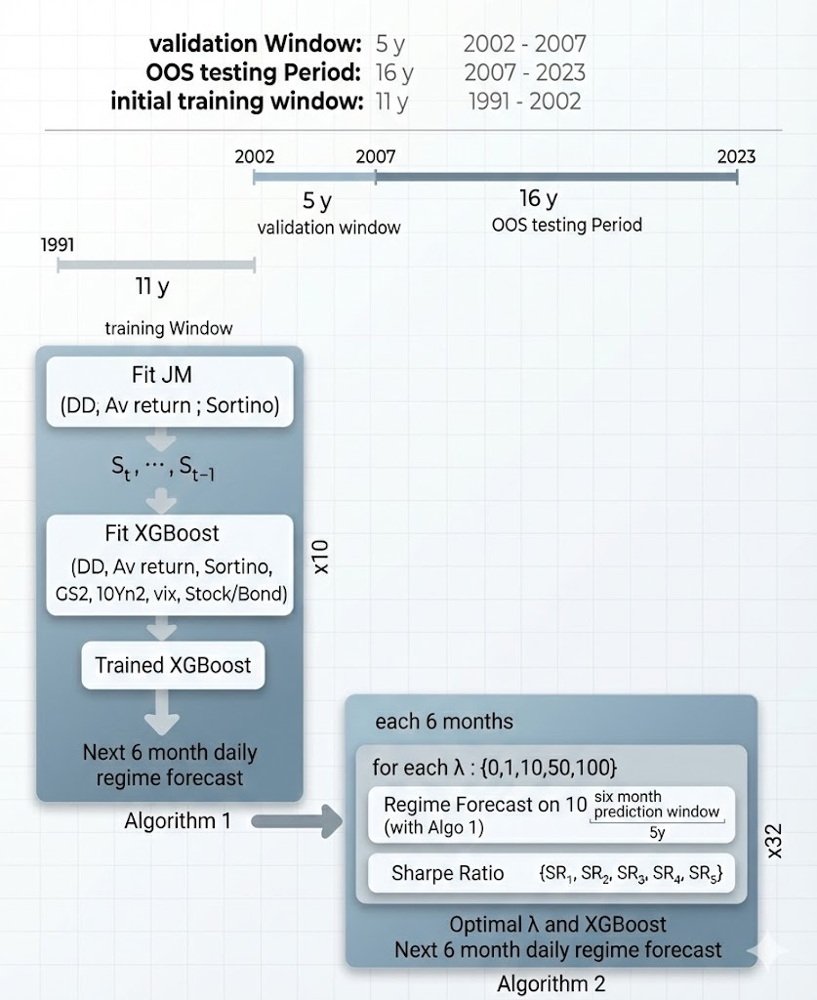

# XGBoost Regime Switching Strategy

This repository contains an implementation of a quantitative trading strategy that combines a Statistical Jump Model (JM) for market regime identification with an XGBoost classifier for return forecasting. 

## Main Algorithm



The core algorithm operates in two primary phases: Regime Identification and Forecasting, which are evaluated iteratively over time using a rolling window approach.

### 1. Market Regime Identification (Statistical Jump Model)
The strategy employs a discrete 2-state Statistical Jump Model (JM) to classify the market environment into distinct regimes (e.g., typically modeling "Bull" / low-volatility and "Bear" / high-volatility states). 
- **Optimization Method**: The model uses an alternating optimization approach, combining K-means style state updates with the Viterbi algorithm to determine the most likely sequence of hidden states.
- **Jump Penalty**: A jump penalty ($\lambda$) is applied to the objective function to constrain the sequence of states. This penalizes frequent state transitions, preventing excessive and unrealistic switching between market regimes due to short-term noise.
- **Online Prediction**: As new data arrives, the model assigns data points to clusters in real-time, considering the last known state and the jump penalty constraint.

### 2. Return Forecasting (XGBoost)
Once the market regime framework is established, an XGBoost classifier is utilized to forecast future price movements. 
- **Lookback Window**: The model is trained on a rolling historical observation window (e.g., an 11-year lookback).
- **Regime-Conditioned Predictions**: By incorporating the regime identified by the JM and additional engineered features, the XGBoost model learns non-linear relationships to generate actionable market predictions.

### 3. Strategy Simulation
The overall strategy is simulated in discrete steps (e.g., 6-month forward-rolling chunks). 
1. **Model Fitting**: For each period, the algorithm fits the Jump Model to identify continuous market states over the lookback window.
2. **Training Forecasting Model**: The XGBoost model is trained on the identified regimes and related features.
3. **Execution**: The strategy makes allocation decisions (e.g., investing in the risky asset or a risk-free alternative) over the forecast horizon based on the model's predictions, aiming to maximize risk-adjusted returns and avoid large drawdowns during turbulent periods.

## Data and Feature Engineering

### Data Sources
The primary data is fetched using Yahoo Finance and FRED APIs:
- **Target Asset**: S&P 500 (`^GSPC`)
- **Bond Proxy**: Vanguard Total Bond Market (`VBMFX`)
- **Risk-Free Rate**: 13-Week Treasury Bill (`^IRX`)
- **Volatility Index**: VIX (`^VIX`)
- **Macro Drivers**: 2-year (`DGS2`) and 10-year (`DGS10`) Treasury Yields from FRED.

Data is fetched from 1987 onwards to accommodate the 11-year training lookback period for the earliest out-of-sample test date.

### Engineered Features
The algorithm computes both Asset-Specific and Cross-Asset Macro features:
- **Asset Specifics**: Log downside deviation (5, 21-day EWMA), Average Returns (5, 10, 21-day EWMA), and Sortino Ratio variants. Return calculation factors in the calculated risk-free daily rate.
- **Macro Features**: 2-Year Yield differentials, Yield Curve Slope (10yr - 2yr with EWMAs), VIX log differences, and 252-day correlation sequences between Stock and Bond returns.

## Backtesting Results

The strategy evaluates backtesting in a fully out-of-sample, walk-forward basis (e.g. from 2004 to early 2026), simulating a real-time trading environment:
- **Walk-Forward Tuning**: Every 6 months, the model tunes the lambda penalty parameter over a 5-year validation window, maximizing the Sharpe ratio. The optimally identified $\lambda$ is then fixed for the next 6 months of out-of-sample forward trading.
- **Evaluation Points**: The simulation records Returns, Volatility, Sharpe Ratio, Sortino Ratio, Max Drawdown, and number of trades generated for the standard Buy-and-Hold versus the complete JM-XGB framework and simple JM benchmark.
- **Report Generation**: The script outputs comprehensive performance metrics and charts plotting wealth curves across the test period to a timestamped PDF, highlighting identified "Bear Regimes" where the strategy likely rotated into the risk-free asset.

## Environment Setup
1. Standard Python environment (minimum 3.8+ recommended).
```markdown
2. Install the necessary packages:
   ```bash
   pip install -r requirements.txt
   ```
```
3. Running the backcast framework:
   ```bash
   python main.py
   ```
   Data is cached locally as `data_cache.pkl` to speed up multiple executions without repeatedly hitting the external APIs. Forecast periods are temporarily cached in-memory during script execution.
4. Launching the interactive dashboard:
   The project includes a Streamlit application to visualize the strategy metrics interactively. You can run it locally with:
   ```bash
   streamlit run app.py
   ```
   Once executed, the dashboard will open in your default browser, allowing you to explore the strategy's performance, view the dynamically-calculated Regime map, and compare asset behavior interactively.
